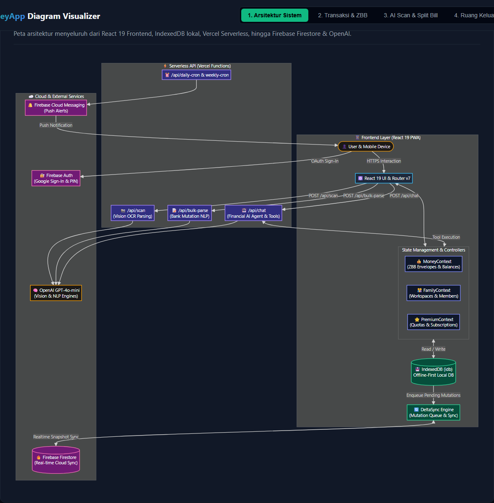
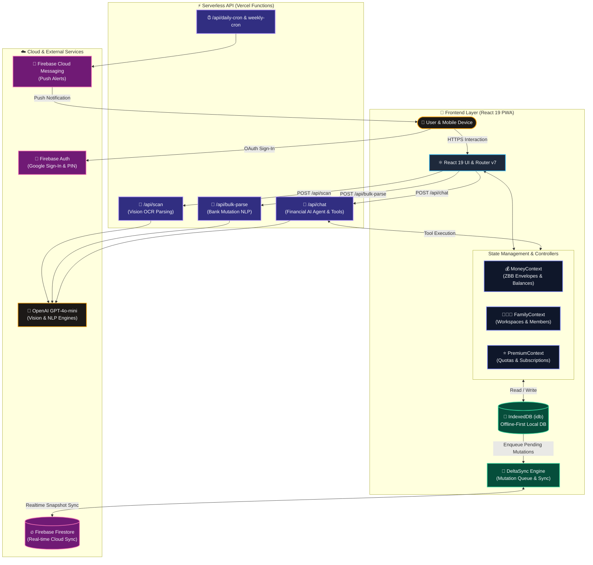
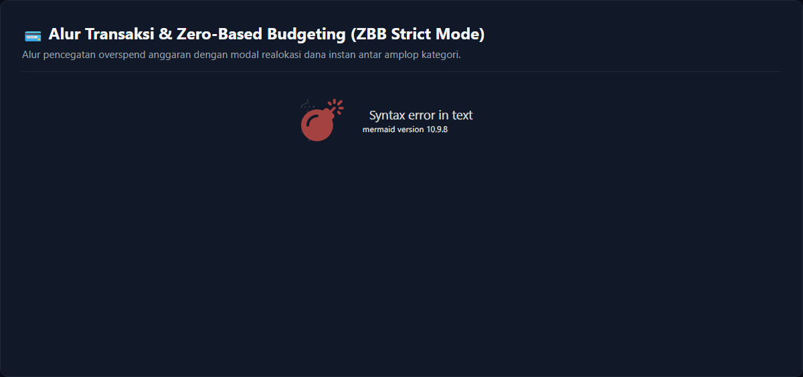
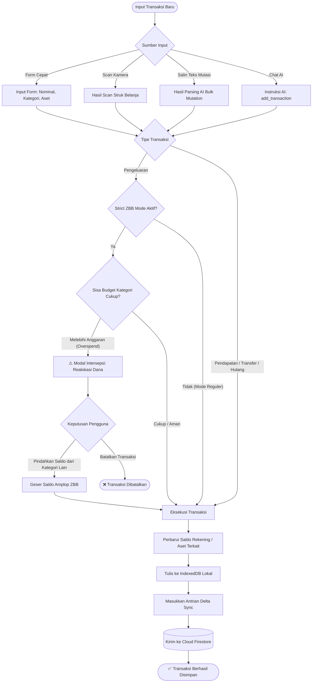
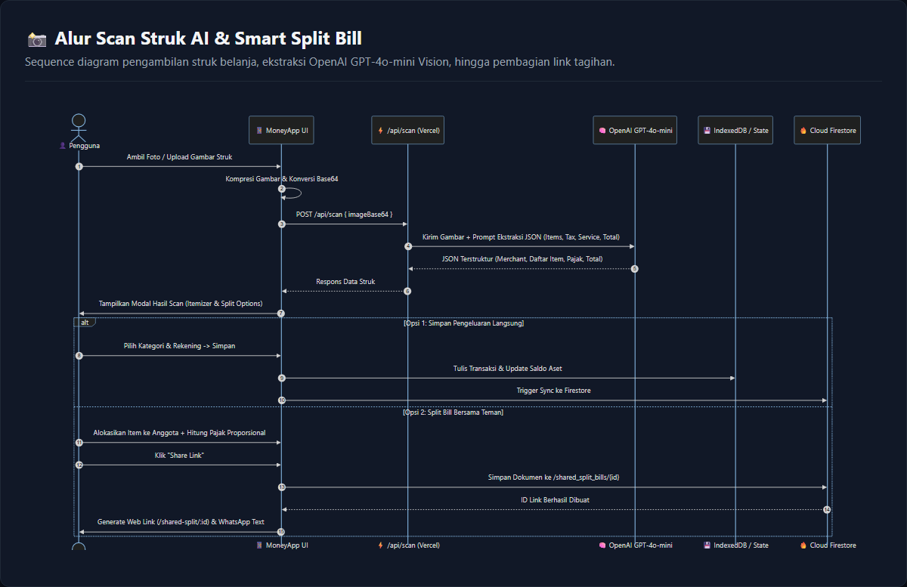
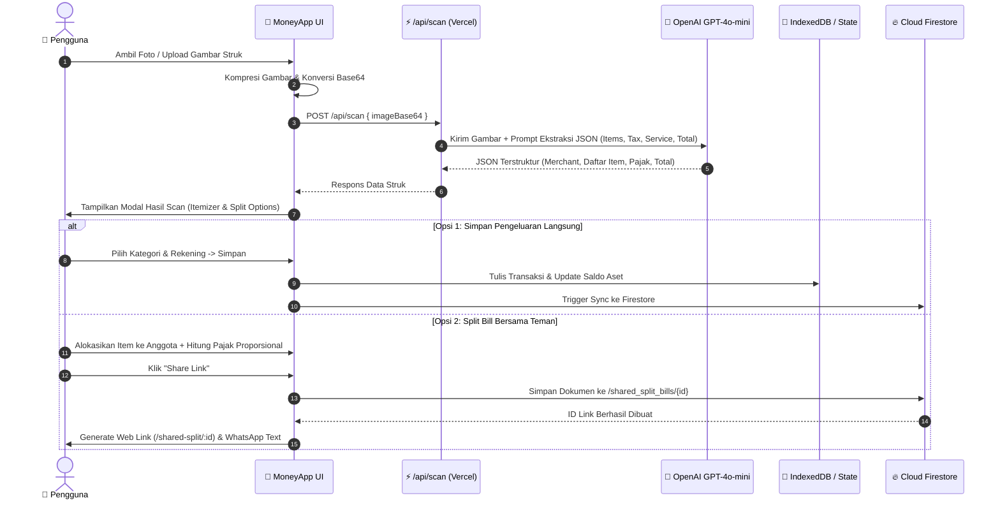
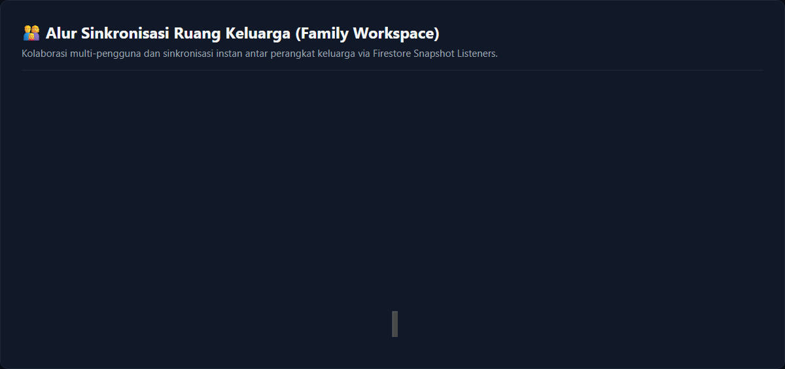
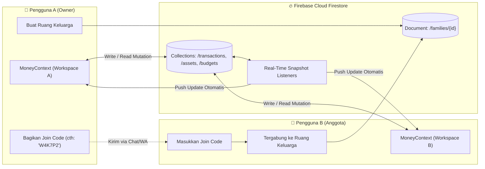

# 📊 MoneyApp - Diagram Alur Sistem & Arsitektur

Dokumentasi visual diagram untuk **MoneyApp** yang mencakup arsitektur sistem, alur pencatatan transaksi dengan Zero-Based Budgeting (ZBB), pipeline kecerdasan buatan (AI & OCR), serta kolaborasi Ruang Keluarga (*Family Workspace*).

> 💡 **Tips Menampilkan**: Berkas ini telah dilengkapi gambar hasil render visual (.png & .svg) sehingga otomatis tampil di semua Markdown Preview tanpa perlu plugin tambahan. Anda juga dapat membuka [moneyapp-mermaid.html](file:///d:/code/moneyreactapp/docs/diagrams/moneyapp-mermaid.html) di browser.

---

## 1. Diagram Arsitektur & Sinkronisasi Data (System Architecture)

<b>Lihat Kode Mermaid</b>

---

## 2. Alur Transaksi & Zero-Based Budgeting (ZBB Strict Mode)

<b>Lihat Kode Mermaid</b>

---

## 3. Sequence Diagram: Scan Struk, AI Parsing & Split Bill

<b>Lihat Kode Mermaid</b>

---

## 4. Alur Sinkronisasi Kolaborasi Ruang Keluarga (Family Workspace)

<b>Lihat Kode Mermaid</b>

