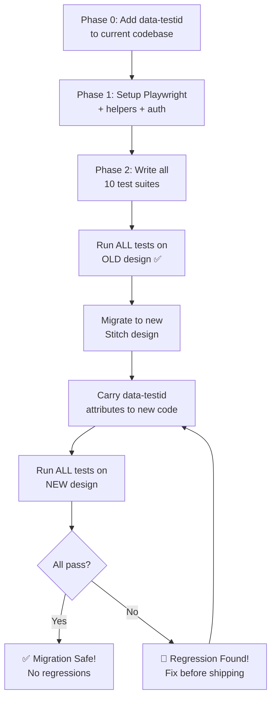

# E2E Regression Test Suite for Design Migration

Ensure that migrating from the current design to the new Stitch design introduces **zero functional regressions**. This test suite will run against both the old and new design, verifying identical behavior.

---

## Critical Design Decision: Preventing Selector Breakage

> [!CAUTION]
> **Problem**: When the UI changes (new Stitch design), CSS classes, HTML structure, and even element positions will change. If tests use selectors like `.btn-primary` or `div > button:nth-child(2)`, they WILL break after migration.

> [!TIP]
> **Solution**: We add `data-testid` attributes to ALL interactive elements in the current code BEFORE writing tests. During migration, these `data-testid` attributes are carried to the new design. Tests only use `data-testid` selectors — they are completely immune to visual/layout changes.

### Selector Strategy (Priority Order)

```
1. data-testid="..."     ← PRIMARY (added by us, survives migration)
2. role + aria-label      ← SECONDARY (accessibility attributes)
3. getByText('...')       ← FALLBACK (only for static labels)
4. Never use: CSS class, nth-child, XPath
```

### Example

```tsx
// OLD DESIGN (current)
<button data-testid="add-transaction-fab" className="fab" onClick={openAdd}>
  <Plus size={32} />
</button>

// NEW DESIGN (Stitch) — completely different styling, same testid
<button data-testid="add-transaction-fab" className="stitch-floating-action" onClick={openAdd}>
  <PlusIcon />
</button>

// TEST — works on BOTH designs
await page.locator('[data-testid="add-transaction-fab"]').click(); ✅
```

---

## Proposed Changes

### Phase 0: Add `data-testid` Attributes (Before Writing Tests)

> [!IMPORTANT]
> This is the most critical phase. We instrument the current codebase with `data-testid` attributes on every interactive element. These attributes are **invisible to users** and have **zero performance impact**.

#### [MODIFY] [Layout.tsx](file:///c:/Users/user.test/OneDrive/Documents/Naufal/Pribadi/code/moneyreactapp/src/components/Layout.tsx)
Add `data-testid` to:
- Each nav link: `data-testid="nav-transactions"`, `nav-statistics"`, `nav-assets"`, `nav-debts"`, `nav-settings"`
- Sidebar toggle: `data-testid="sidebar-toggle"`
- Sidebar container: `data-testid="sidebar-nav"`

#### [MODIFY] [Transactions.tsx](file:///c:/Users/user.test/OneDrive/Documents/Naufal/Pribadi/code/moneyreactapp/src/pages/Transactions.tsx)
Add `data-testid` to:
- Income summary card: `data-testid="income-card"`
- Expense summary card: `data-testid="expense-card"`
- Income amount display: `data-testid="income-amount"`
- Expense amount display: `data-testid="expense-amount"`
- Month label: `data-testid="month-label"`
- Month prev/next: `data-testid="month-prev"`, `data-testid="month-next"`
- Search toggle: `data-testid="search-toggle"`
- Search input: `data-testid="search-input"`
- Group by buttons: `data-testid="groupby-date"`, `data-testid="groupby-category"`, etc.
- FAB button: `data-testid="add-transaction-fab"`
- Each transaction item: `data-testid="transaction-item-{id}"`
- Pace indicator: `data-testid="spending-pace"`

#### [MODIFY] [TransactionModal.tsx](file:///c:/Users/user.test/OneDrive/Documents/Naufal/Pribadi/code/moneyreactapp/src/components/modals/TransactionModal.tsx)
Add `data-testid` to:
- Modal container: `data-testid="transaction-modal"`
- Type tabs (pengeluaran/pendapatan/transfer): `data-testid="tx-type-{type}"`
- Amount input: `data-testid="tx-amount-input"`
- Category selector: `data-testid="tx-category-select"`
- Asset selector: `data-testid="tx-asset-select"`
- Note input: `data-testid="tx-note-input"`
- Date input: `data-testid="tx-date-input"`
- Submit button: `data-testid="tx-submit-btn"`
- Delete button: `data-testid="tx-delete-btn"`

#### [MODIFY] [Assets.tsx](file:///c:/Users/user.test/OneDrive/Documents/Naufal/Pribadi/code/moneyreactapp/src/pages/Assets.tsx)
Add `data-testid` to:
- Net worth carousel: `data-testid="net-worth-carousel"`
- Add asset button: `data-testid="add-asset-btn"`
- Each asset card: `data-testid="asset-card-{id}"`
- Asset balance display: `data-testid="asset-balance-{id}"`
- Asset detail drawer: `data-testid="asset-drawer"`
- Private mode toggle area: existing in carousel
- Hidden assets accordion: `data-testid="hidden-assets-toggle"`

#### [MODIFY] [AssetModal.tsx](file:///c:/Users/user.test/OneDrive/Documents/Naufal/Pribadi/code/moneyreactapp/src/components/modals/AssetModal.tsx)
Add `data-testid` to:
- Modal container: `data-testid="asset-modal"`
- Name input: `data-testid="asset-name-input"`
- Type selector: `data-testid="asset-type-select"`
- Balance input: `data-testid="asset-balance-input"`
- Submit button: `data-testid="asset-submit-btn"`

#### [MODIFY] [Debts.tsx](file:///c:/Users/user.test/OneDrive/Documents/Naufal/Pribadi/code/moneyreactapp/src/pages/Debts.tsx)
Add `data-testid` to:
- Summary hutang card: `data-testid="debt-summary-hutang"`
- Summary piutang card: `data-testid="debt-summary-piutang"`
- Net position banner: `data-testid="debt-net-position"`
- Filter tabs: `data-testid="debt-filter-{tab}"`
- Each debt card: `data-testid="debt-card-{id}"`
- Pay button: `data-testid="debt-pay-{id}"`
- FAB add button: `data-testid="add-debt-fab"`
- Offset banner: `data-testid="debt-offset-banner"`

#### [MODIFY] [DebtModal.tsx](file:///c:/Users/user.test/OneDrive/Documents/Naufal/Pribadi/code/moneyreactapp/src/components/modals/DebtModal.tsx)
Add `data-testid` to key form fields and submit button.

#### [MODIFY] [Settings.tsx](file:///c:/Users/user.test/OneDrive/Documents/Naufal/Pribadi/code/moneyreactapp/src/pages/Settings.tsx)
Add `data-testid` to:
- Theme toggle: `data-testid="theme-toggle"`
- Currency input: `data-testid="currency-input"`
- Start of month selector: `data-testid="start-of-month"`
- Budget mode toggle: `data-testid="budget-mode-toggle"`
- Private mode toggle: `data-testid="private-mode-toggle"`
- Export button: `data-testid="export-data-btn"`
- Import button: `data-testid="import-data-btn"`
- Category management section: `data-testid="category-management"`
- Each settings section: `data-testid="settings-{section}"`

#### [MODIFY] [BudgetManagement.tsx](file:///c:/Users/user.test/OneDrive/Documents/Naufal/Pribadi/code/moneyreactapp/src/components/BudgetManagement.tsx)
Add `data-testid` to:
- Global budget card: `data-testid="budget-global"`
- Circle progress: `data-testid="budget-progress"`
- Add budget button: `data-testid="add-budget-btn"`
- Each category budget card: `data-testid="budget-card-{id}"`
- Month nav: `data-testid="budget-month-prev"`, `data-testid="budget-month-next"`

#### [MODIFY] [Trips.tsx](file:///c:/Users/user.test/OneDrive/Documents/Naufal/Pribadi/code/moneyreactapp/src/pages/Trips.tsx) & [TripDetail.tsx](file:///c:/Users/user.test/OneDrive/Documents/Naufal/Pribadi/code/moneyreactapp/src/pages/TripDetail.tsx)
Add `data-testid` to trip cards, add trip button, expense items, settlement UI.

#### [MODIFY] [Statistics.tsx](file:///c:/Users/user.test/OneDrive/Documents/Naufal/Pribadi/code/moneyreactapp/src/pages/Statistics.tsx)
Add `data-testid` to chart containers, stat items, month navigation.

#### [MODIFY] [ReceiptScanner.tsx](file:///c:/Users/user.test/OneDrive/Documents/Naufal/Pribadi/code/moneyreactapp/src/pages/ReceiptScanner.tsx) & [BulkInput.tsx](file:///c:/Users/user.test/OneDrive/Documents/Naufal/Pribadi/code/moneyreactapp/src/pages/BulkInput.tsx)
Add `data-testid` to upload areas, scan buttons, result displays, error states.

#### [MODIFY] [AuthScreen.tsx](file:///c:/Users/user.test/OneDrive/Documents/Naufal/Pribadi/code/moneyreactapp/src/components/AuthScreen.tsx)
Add `data-testid` to:
- Email input: `data-testid="auth-email"`
- Password input: `data-testid="auth-password"`
- Sign in button: `data-testid="auth-signin-btn"`
- Sign up button: `data-testid="auth-signup-btn"`
- Google sign-in: `data-testid="auth-google-btn"`
- Error message: `data-testid="auth-error"`

---

### Phase 1: Test Infrastructure

#### [NEW] [playwright.config.ts](file:///c:/Users/user.test/OneDrive/Documents/Naufal/Pribadi/code/moneyreactapp/playwright.config.ts)
- Configure Playwright for the Vite dev server (`http://localhost:5173`)
- Set up `webServer` to auto-start `npm run dev` before tests
- Mobile viewport: `390×844` (iPhone 14 Pro, mobile-first PWA)
- Desktop viewport project for sidebar navigation testing
- Set `testDir` to `e2e/`
- Enable screenshots on failure + HTML reporter
- Configure `storageState` for auth persistence across tests

#### [NEW] [e2e/helpers/seed.ts](file:///c:/Users/user.test/OneDrive/Documents/Naufal/Pribadi/code/moneyreactapp/e2e/helpers/seed.ts)
- Helper to seed test data directly into IndexedDB via `page.evaluate()`
- Seed functions for: assets, transactions, categories, budgets, debts, goals, trips, contacts, settings
- `seedFullTestData()` for a realistic dataset
- `clearDatabase()` to reset between tests
- `verifyInIndexedDB()` for data integrity checks

#### [NEW] [e2e/helpers/selectors.ts](file:///c:/Users/user.test/OneDrive/Documents/Naufal/Pribadi/code/moneyreactapp/e2e/helpers/selectors.ts)
- **All selectors use `data-testid`** — zero dependency on CSS classes
- Organized by page/component
- Helper function `tid(id: string)` → `[data-testid="${id}"]`

#### [NEW] [e2e/helpers/auth.ts](file:///c:/Users/user.test/OneDrive/Documents/Naufal/Pribadi/code/moneyreactapp/e2e/helpers/auth.ts)
- Real Firebase auth helper: `signUp(email, password)` and `signIn(email, password)`
- Uses a dedicated test account (e.g., `moneyapp-e2e-test@test.com`)
- Saves auth state to `storageState` file so subsequent tests don't re-login
- `globalSetup` function that authenticates once, saves cookies/localStorage

#### [MODIFY] [package.json](file:///c:/Users/user.test/OneDrive/Documents/Naufal/Pribadi/code/moneyreactapp/package.json)
- Add `@playwright/test` as devDependency
- Add scripts:
  - `"test:e2e": "playwright test"`
  - `"test:e2e:ui": "playwright test --ui"`
  - `"test:e2e:headed": "playwright test --headed"`

---

### Phase 2: Test Suites

#### Test Suite 1: Authentication (Real Firebase)

##### [NEW] [e2e/auth.spec.ts](file:///c:/Users/user.test/OneDrive/Documents/Naufal/Pribadi/code/moneyreactapp/e2e/auth.spec.ts)

| # | Test Case | What It Verifies |
|---|-----------|-----------------|
| 1 | Sign up with email/password | Fill email + password → submit → redirected to main app |
| 2 | Sign in with existing account | Fill email + password → submit → data loads |
| 3 | Sign in with wrong password shows error | Error message displayed via `data-testid="auth-error"` |
| 4 | Sign out | Click logout in settings → redirected to auth screen |
| 5 | Auth state persists on reload | After sign in → reload page → still authenticated |

---

#### Test Suite 2: Navigation & Layout

##### [NEW] [e2e/navigation.spec.ts](file:///c:/Users/user.test/OneDrive/Documents/Naufal/Pribadi/code/moneyreactapp/e2e/navigation.spec.ts)

| # | Test Case | Selector Used |
|---|-----------|--------------|
| 1 | Bottom nav renders 5 tabs (mobile) | `[data-testid="nav-*"]` count |
| 2 | Clicking each tab navigates to correct route | `[data-testid="nav-transactions"]` etc. |
| 3 | Active tab is highlighted | `aria-current="page"` attribute |
| 4 | Page title renders on each page | `[data-testid="page-title"]` text |
| 5 | Sidebar renders on desktop viewport | `[data-testid="sidebar-nav"]` |
| 6 | Sidebar collapse/expand works | `[data-testid="sidebar-toggle"]` |

---

#### Test Suite 3: Transaction CRUD + Data Integrity

##### [NEW] [e2e/transactions.spec.ts](file:///c:/Users/user.test/OneDrive/Documents/Naufal/Pribadi/code/moneyreactapp/e2e/transactions.spec.ts)

| # | Test Case | Selector Used |
|---|-----------|--------------|
| 1 | Income card shows correct total | `[data-testid="income-amount"]` |
| 2 | Expense card shows correct total | `[data-testid="expense-amount"]` |
| 3 | Click income card → modal opens as pendapatan | `[data-testid="income-card"]` → `[data-testid="transaction-modal"]` |
| 4 | Click expense card → modal opens as pengeluaran | `[data-testid="expense-card"]` → `[data-testid="transaction-modal"]` |
| 5 | Add expense: fill & submit → appears in list | `[data-testid="tx-amount-input"]` etc. → `[data-testid="transaction-item-*"]` |
| 6 | **Data integrity**: added tx exists in IndexedDB | `page.evaluate()` → verify in IDB |
| 7 | Add income transaction | Same flow, `pendapatan` type |
| 8 | Add transfer transaction | `[data-testid="tx-type-transfer"]` + from/to assets |
| 9 | Edit transaction → amount updates | `[data-testid="transaction-item-{id}"]` → edit modal → save |
| 10 | Delete transaction → undo toast appears | Delete → toast with "Undo" action |
| 11 | Copy transaction | Copy action → pre-filled modal → submit |
| 12 | Month prev/next navigation | `[data-testid="month-prev"]`, `[data-testid="month-next"]` |
| 13 | Month picker modal | `[data-testid="month-label"]` click |
| 14 | Group by date/category/asset | `[data-testid="groupby-*"]` |
| 15 | Search transactions | `[data-testid="search-input"]` |
| 16 | Spending pace indicator | `[data-testid="spending-pace"]` with seeded budget |

---

#### Test Suite 4: Asset Management + Data Integrity

##### [NEW] [e2e/assets.spec.ts](file:///c:/Users/user.test/OneDrive/Documents/Naufal/Pribadi/code/moneyreactapp/e2e/assets.spec.ts)

| # | Test Case | Selector Used |
|---|-----------|--------------|
| 1 | Asset list renders all seeded assets | `[data-testid="asset-card-*"]` |
| 2 | Net worth carousel correct total | `[data-testid="net-worth-carousel"]` |
| 3 | Add asset → appears in list | `[data-testid="add-asset-btn"]` → modal → `[data-testid="asset-submit-btn"]` |
| 4 | **Data integrity**: added asset in IndexedDB | `page.evaluate()` → verify |
| 5 | Edit asset name | `[data-testid="asset-card-{id}"]` edit → save |
| 6 | Delete asset (soft delete) | Confirm dialog → asset gone from list |
| 7 | Asset detail drawer opens | `[data-testid="asset-card-{id}"]` click → `[data-testid="asset-drawer"]` |
| 8 | Drawer income/expense filter | Masuk/Keluar filter tabs |
| 9 | Balance reflects transactions | Add expense → balance decreases |
| 10 | Hidden assets accordion | `[data-testid="hidden-assets-toggle"]` |
| 11 | Private mode hides amounts | Toggle → amounts show `••••••••` |

---

#### Test Suite 5: Debt & Piutang Management

##### [NEW] [e2e/debts.spec.ts](file:///c:/Users/user.test/OneDrive/Documents/Naufal/Pribadi/code/moneyreactapp/e2e/debts.spec.ts)

| # | Test Case | Selector Used |
|---|-----------|--------------|
| 1 | Summary cards show totals | `[data-testid="debt-summary-hutang"]`, `[data-testid="debt-summary-piutang"]` |
| 2 | Net position banner | `[data-testid="debt-net-position"]` |
| 3 | Add hutang → appears in list | Modal → `[data-testid="debt-card-*"]` |
| 4 | Add piutang → appears in list | Same flow |
| 5 | **Data integrity**: debt in IndexedDB | `page.evaluate()` → verify |
| 6 | Remaining amount correct | Card displays `totalAmount - paidAmount` |
| 7 | Partial payment reduces remaining | `[data-testid="debt-pay-{id}"]` → enter amount → confirm |
| 8 | Settle fully → LUNAS badge | Mark lunas → status updates |
| 9 | Unmark paid debt | Menu → "Tandai Belum Lunas" |
| 10 | Add principal → total increases | Menu → "Tambah Nominal" |
| 11 | Delete with confirmation | Confirm dialog → removed |
| 12 | Installment progress bar | Seeded installment debt renders progress |
| 13 | Filter tabs work | `[data-testid="debt-filter-aktif"]` etc. |
| 14 | Expand → history section | Click expand → related transactions shown |
| 15 | Due date warnings | Overdue = "JATUH TEMPO", Soon = "SEGERA" |
| 16 | Offset banner for mutual debts | `[data-testid="debt-offset-banner"]` |

---

#### Test Suite 6: Budget Management

##### [NEW] [e2e/budgets.spec.ts](file:///c:/Users/user.test/OneDrive/Documents/Naufal/Pribadi/code/moneyreactapp/e2e/budgets.spec.ts)

| # | Test Case | Selector Used |
|---|-----------|--------------|
| 1 | Global budget hero card | `[data-testid="budget-global"]` |
| 2 | Circle progress correct % | `[data-testid="budget-progress"]` SVG text |
| 3 | Over-budget warning | Danger styling when spent > limit |
| 4 | Add category budget | `[data-testid="add-budget-btn"]` → modal → submit |
| 5 | Edit budget limit | Menu → "Edit" → change → save |
| 6 | Delete budget | Menu → "Hapus" → confirm |
| 7 | Category cards show progress | `[data-testid="budget-card-*"]` |
| 8 | Month navigation | `[data-testid="budget-month-prev"]`, `[data-testid="budget-month-next"]` |
| 9 | Copy from previous month | "Salin Bulan Lalu" button |
| 10 | Zero-based budgeting mode | Envelope cards with "Tersedia" |

---

#### Test Suite 7: AI Features (Functional Tests)

##### [NEW] [e2e/ai-features.spec.ts](file:///c:/Users/user.test/OneDrive/Documents/Naufal/Pribadi/code/moneyreactapp/e2e/ai-features.spec.ts)

> [!NOTE]
> These tests verify the AI features **work functionally** — that the UI loads, accepts input, calls the API, and displays results. They use the real OpenAI API key from `.env`.

| # | Test Case | What It Verifies |
|---|-----------|-----------------|
| 1 | Receipt Scanner page loads | Navigate to `/scan` → camera/upload UI renders |
| 2 | Upload receipt image → OCR processes | Upload a test receipt image → loading state → results appear |
| 3 | OCR results can be saved as transactions | Parsed items display → click save → transactions created |
| 4 | Bulk Input page loads | Navigate to `/bulk-input` → text input area renders |
| 5 | Bulk Input AI parsing works | Paste text → click parse → parsed transactions appear in editor |
| 6 | Bulk Input results can be saved | Parsed results → click save all → transactions created |
| 7 | ChatBot opens and responds | Click chat FAB → type message → AI response appears |
| 8 | ChatBot can answer financial questions | Ask "berapa pengeluaran bulan ini" → response includes data |
| 9 | AI error handling | Invalid input → error state displayed gracefully |

---

#### Test Suite 8: Settings & Preferences

##### [NEW] [e2e/settings.spec.ts](file:///c:/Users/user.test/OneDrive/Documents/Naufal/Pribadi/code/moneyreactapp/e2e/settings.spec.ts)

| # | Test Case | Selector Used |
|---|-----------|--------------|
| 1 | Settings page renders all sections | `[data-testid="settings-*"]` |
| 2 | Theme toggle works | `[data-testid="theme-toggle"]` → `data-theme` attr changes |
| 3 | Currency symbol change | `[data-testid="currency-input"]` → `$` → amounts update |
| 4 | **Data integrity**: currency saved to IDB | `page.evaluate()` → verify |
| 5 | Start of month day | `[data-testid="start-of-month"]` → changes period |
| 6 | Default grouping persists | Toggle → navigate to transactions → grouping applied |
| 7 | Hide debt in transactions | Toggle → debt txs hidden on main page |
| 8 | Category CRUD | Add → edit → delete category |
| 9 | Contact CRUD | Add → edit → delete contact |
| 10 | Export data triggers download | `[data-testid="export-data-btn"]` → blob created |
| 11 | Budget mode toggle | `[data-testid="budget-mode-toggle"]` → view changes |
| 12 | Private mode toggle | `[data-testid="private-mode-toggle"]` → amounts masked |
| 13 | Recurring transactions CRUD | Add/edit/delete recurring rules |
| 14 | Subscription CRUD | Add/edit/delete subscriptions |
| 15 | Goal management CRUD | Add/edit/delete financial goals |

---

#### Test Suite 9: Trips & Split Bill

##### [NEW] [e2e/trips.spec.ts](file:///c:/Users/user.test/OneDrive/Documents/Naufal/Pribadi/code/moneyreactapp/e2e/trips.spec.ts)

| # | Test Case |
|---|-----------|
| 1 | Trip list renders seeded trips |
| 2 | Create new trip with members |
| 3 | Trip detail page loads at `/trips/:id` |
| 4 | Add expense with payer and splits |
| 5 | Splits calculate correctly per member |
| 6 | Settlement shows correct amounts |
| 7 | Delete trip removes it |
| 8 | Shared split bill page loads at `/shared-split/:id` |

---

#### Test Suite 10: Statistics Page

##### [NEW] [e2e/statistics.spec.ts](file:///c:/Users/user.test/OneDrive/Documents/Naufal/Pribadi/code/moneyreactapp/e2e/statistics.spec.ts)

| # | Test Case |
|---|-----------|
| 1 | Statistics page loads with chart SVG elements |
| 2 | Month navigation updates charts |
| 3 | Stat detail modal opens on click |
| 4 | Income vs Expense comparison displayed |
| 5 | Category breakdown with percentages |
| 6 | Stats carousel cards switchable |

---

## File Summary

| File | Purpose | Tests |
|------|---------|-------|
| `playwright.config.ts` | Playwright config (viewport, auth, server) | — |
| `e2e/helpers/seed.ts` | IndexedDB seeding + data integrity helpers | — |
| `e2e/helpers/selectors.ts` | `data-testid` selector constants | — |
| `e2e/helpers/auth.ts` | Real Firebase signup/signin helpers | — |
| `e2e/auth.spec.ts` | Authentication flows | 5 |
| `e2e/navigation.spec.ts` | Navigation & layout | 6 |
| `e2e/transactions.spec.ts` | Transaction CRUD + data integrity | 16 |
| `e2e/assets.spec.ts` | Asset management + data integrity | 11 |
| `e2e/debts.spec.ts` | Debt & piutang management | 16 |
| `e2e/budgets.spec.ts` | Budget management | 10 |
| `e2e/ai-features.spec.ts` | AI features (Scanner, Bulk, ChatBot) | 9 |
| `e2e/settings.spec.ts` | Settings & preferences + data integrity | 15 |
| `e2e/trips.spec.ts` | Trips & split bill | 8 |
| `e2e/statistics.spec.ts` | Statistics page | 6 |

**Total: ~102 regression test cases across 10 test suites**

---

## Execution Workflow



---

## Verification Plan

### Phase 0 Verification
- After adding `data-testid` → run `grep -r 'data-testid' src/ | wc -l` → should have 80+ attributes
- Verify the app still builds: `npm run build`

### Phase 2 Verification
1. **Run full suite on OLD design**: `npx playwright test` — all 102 tests MUST pass
2. **Apply Stitch design migration** (carry `data-testid` to new components)
3. **Run full suite on NEW design**: `npx playwright test` — all 102 tests MUST pass
4. Any failure = functional regression in the new design

### Debugging
- `npx playwright test --ui` — visual test runner with step-by-step replay
- `npx playwright test --headed` — watch tests run in a real browser
- Screenshots captured automatically on failure in `test-results/`
